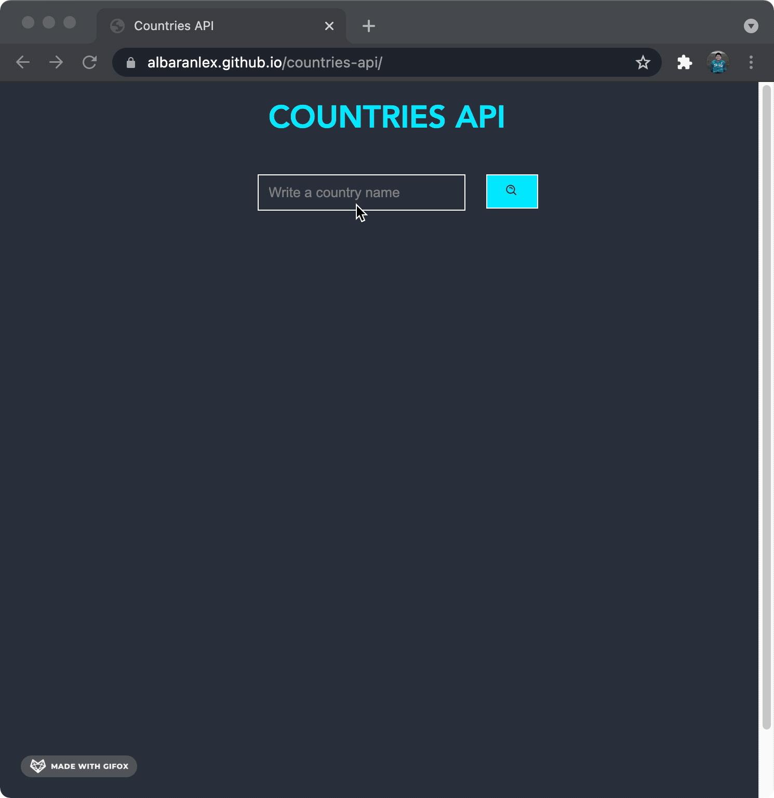

## Project Link

<https://albaranlex.github.io/countries-api/>

## Project Summary

- The project utilizes React JS, which includes, but not limited to, components, props, hooks and events. The website layout was done with SCSS.
- The target of the project is mainly to show how to grab data from an API using `axios`.
- The website is responsive with breakpoints specified on `mixins`.

## Available Scripts

In the project directory, you can run:

### `npm start`

Runs the app in the development mode.\
Open [http://localhost:3000](http://localhost:3000) to view it in the browser.

The page will reload if you make edits.\
You will also see any lint errors in the console.

## Node SASS

To install, you can run

### `npm i node-sass`

Installs scss to the project folder.\

## Packages Used

### React Icons (Icons)

To install, you can run `npm install react-icons --save`\
Link to full documentation: <https://react-icons.github.io/react-icons/>

### React Spinners (Dot Loader)

To install, you can run `npm i react-spinners`\
Link to full documentation: <https://www.npmjs.com/package/react-spinners>

## API Used

Link: <https://restcountries.eu/rest/v2/>
